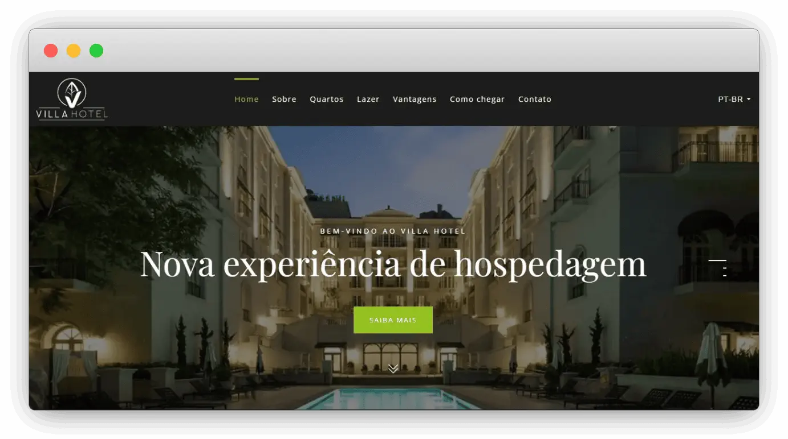

# Ingrid Drummond

Site feito por mim enquanto Estagiário em Desenvolvimento Web. Completamente responsivo feito para um cliente Hotel, localizado em Rio Piracicaba - MG.

Foi totalmente feito a partir de um template Wordpress, porém editado no próprio VSCode. 

Projeto que me ajudou a melhorar minha capacidade de entender o código de terceiros e alterá-lo conforme as necessidades do cliente. 

    <h3>Web Development:</h3>
    
    
    
    <h3>Frameworks, Platforms and Libraries:</h3>
    

# Final Result 🔥 

 

## Starting 

To start the project, just open the file `index.html` in your preferred browser...

To open the project right now, click on the link: https://matheuslopesm.github.io/villa-hotel/

--- 

##### Make with 🧠 by Matheus Lopes.